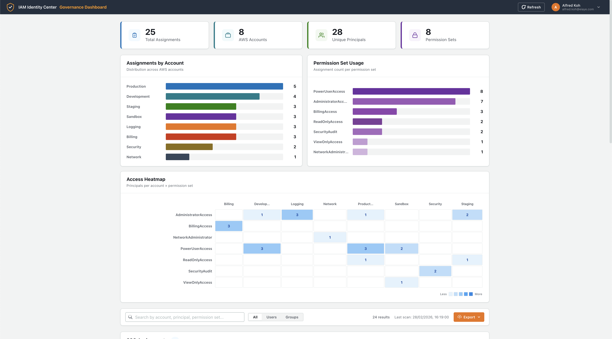
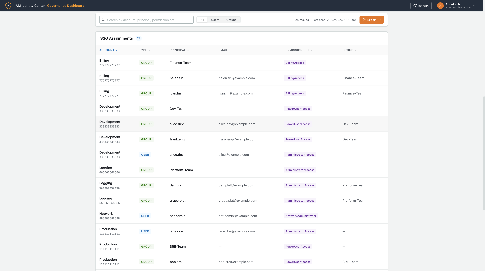

# AWS IAM Identity Center Governance Dashboard

An open-source, serverless governance dashboard that audits AWS IAM Identity Center (SSO) permission assignments across your entire AWS Organization.

## Screenshots





## Architecture

```
┌─────────────┐     ┌──────────────────┐     ┌─────────────────┐
│   Amplify    │────▶│  Athena Proxy    │────▶│     Athena      │
│  (React UI) │     │    (Lambda)      │     │   (SQL Query)   │
│  SSO Auth   │     │  + Fast Cache    │     │                 │
└─────────────┘     └──────────────────┘     └────────┬────────┘
                                                      │
                                                      ▼
┌─────────────┐     ┌──────────────────┐     ┌─────────────────┐
│  EventBridge│────▶│  Step Functions  │────▶│   S3 Inventory  │
│  (Schedule) │     │ Distributed Map  │     │   (CSV files)   │
└─────────────┘     └──────────────────┘     └─────────────────┘
                           │
                    ┌──────┴──────┐
                    ▼             ▼
              ┌──────────┐ ┌──────────┐
              │  Worker  │ │  Worker  │  ... per account
              │ (Lambda) │ │ (Lambda) │
              └──────────┘ └──────────┘
```

## Features

- **Full Org Crawl**: Discovers all accounts in your AWS Organization and audits IAM Identity Center assignments
- **Distributed Processing**: Step Functions with Distributed Map for parallel per-account scanning
- **User & Group Resolution**: Resolves user/group GUIDs to friendly names and emails, expands group memberships
- **Fast-Load Cache**: Athena Proxy checks for pre-rendered `summary.json` before running SQL
- **SSO-Secured Frontend**: React dashboard protected by Identity Center OIDC authentication
- **Cost-Optimized**: 24-hour S3 lifecycle policies, no Glue Crawlers, fully serverless
- **Security Hardened**: S3 encryption at rest, configurable CORS, input validation, concurrency guardrails

## Prerequisites

- AWS Account with IAM Identity Center enabled
- Terraform >= 1.5
- Node.js >= 18
- Python 3.12
- AWS CLI configured with appropriate permissions

### Required IAM Permissions for Deployment

The IAM principal running `terraform apply` needs permissions for:

- S3 (create/manage buckets)
- Lambda (create/manage functions)
- IAM (create roles and policies)
- Step Functions (create state machines)
- Athena & Glue (create workgroups, databases, tables)
- Amplify (create apps)
- CloudWatch Logs (create log groups)

## Quick Start

### 1. Clone the Repository

```bash
git clone https://github.com/your-org/aws-iam-identity-center-governance-dashboard.git
cd aws-iam-identity-center-governance-dashboard
```

### 2. Configure Variables

```bash
cp terraform.tfvars.example terraform.tfvars
```

Edit `terraform.tfvars` with your values. At minimum, set:

| Variable | Description | Example |
|----------|-------------|---------|
| `resource_prefix` | Unique prefix for all resources | `myorg-idc-gov` |
| `sso_instance_arn` | ARN of your IAM Identity Center instance | `arn:aws:sso:::instance/ssoins-xxxxxxxx` |
| `identity_store_id` | Identity Store ID | `d-xxxxxxxxxx` |
| `org_management_account_id` | AWS Organization management account ID | `123456789012` |

### 3. Deploy Infrastructure

```bash
cd terraform
terraform init
terraform plan    # Review the changes
terraform apply
```

### 4. Build & Deploy Frontend

```bash
cd frontend
npm install
npm run build
# Deploy via Amplify (auto-deployed on git push if configured)
```

## Okta SSO Setup

The dashboard supports Okta OIDC single sign-on. When Okta is not configured, it falls back to local username/password authentication.

### 1. Create an Okta Application

1. Log into your [Okta Admin Console](https://your-org-admin.okta.com/admin/apps/active)
2. Go to **Applications** → **Create App Integration**
3. Select:
   - **Sign-in method**: OIDC – OpenID Connect
   - **Application type**: Single-Page Application (SPA)
4. Click **Next**

### 2. Configure the Application

| Setting | Value |
|---------|-------|
| **App integration name** | `IAM Governance Dashboard` (or any name) |
| **Grant type** | ✅ Authorization Code |
| **Sign-in redirect URIs** | `http://localhost:3000/callback` (dev) |
| | `https://your-amplify-domain.amplifyapp.com/callback` (prod) |
| **Sign-out redirect URIs** | `http://localhost:3000` (dev) |
| | `https://your-amplify-domain.amplifyapp.com` (prod) |
| **Controlled access** | Choose who can access (e.g., "Allow everyone in your organization") |

5. Click **Save**
6. On the app's **General** tab, copy the **Client ID**

### 3. Set Environment Variables

Create a `.env` file in the `frontend/` directory:

```bash
# frontend/.env
REACT_APP_OKTA_DOMAIN=your-org.okta.com
REACT_APP_OKTA_CLIENT_ID=0oaXXXXXXXXXXXXXXXXX
REACT_APP_OKTA_REDIRECT_URI=http://localhost:3000/callback
```

> **Note:** Your Okta domain is the non-admin URL (e.g., `your-org.okta.com`, not `your-org-admin.okta.com`). You can find it under **Settings** → **Account** in the Okta Admin Console.

### 4. Restart the Dev Server

```bash
cd frontend
npm start
```

The login page will automatically show a **"Sign in with Okta"** button instead of the local username/password form.

### Production Deployment

For Amplify-hosted deployments, set the same environment variables in your Amplify app's **Environment variables** settings, updating the redirect URI to your production URL:

```
REACT_APP_OKTA_DOMAIN=your-org.okta.com
REACT_APP_OKTA_CLIENT_ID=0oaXXXXXXXXXXXXXXXXX
REACT_APP_OKTA_REDIRECT_URI=https://main.d1234abcde.amplifyapp.com/callback
```

## Configuration Reference

### Required Variables

| Variable | Type | Description |
|----------|------|-------------|
| `resource_prefix` | `string` | Prefix for all resource names (must be globally unique) |
| `sso_instance_arn` | `string` | ARN of your IAM Identity Center instance |
| `identity_store_id` | `string` | Identity Store ID |
| `org_management_account_id` | `string` | AWS Organization management account ID |

### Security Variables

| Variable | Type | Default | Description |
|----------|------|---------|-------------|
| `allowed_origins` | `list(string)` | `["*"]` | CORS origins for the API. Restrict to your Amplify domain in production. |
| `lambda_url_auth_type` | `string` | `"NONE"` | `NONE` for demo, `AWS_IAM` for production |
| `force_destroy_buckets` | `bool` | `false` | Allow `terraform destroy` to delete non-empty buckets |

### Cost & Performance Variables

| Variable | Type | Default | Description |
|----------|------|---------|-------------|
| `log_retention_days` | `number` | `7` | CloudWatch Logs retention period |
| `worker_reserved_concurrency` | `number` | `10` | Max concurrent worker Lambda executions |
| `athena_proxy_reserved_concurrency` | `number` | `5` | Max concurrent proxy Lambda executions |

### Optional Variables

| Variable | Type | Default | Description |
|----------|------|---------|-------------|
| `aws_region` | `string` | `us-east-1` | AWS deployment region |
| `project_name` | `string` | `idc-governance` | Tag value for resource identification |
| `environment` | `string` | `production` | Tag value for environment |
| `github_repository` | `string` | `""` | GitHub repo URL for Amplify auto-deploy |
| `github_oauth_token` | `string` | `""` | GitHub PAT for Amplify (sensitive) |
| `sso_oidc_issuer_url` | `string` | `""` | OIDC issuer URL for frontend auth |
| `sso_oidc_client_id` | `string` | `""` | OIDC client ID for frontend auth |

## Project Structure

```
├── terraform/          # All infrastructure as code
│   ├── main.tf         # Provider configuration
│   ├── variables.tf    # All configurable variables
│   ├── s3.tf           # S3 buckets (encrypted, lifecycle policies)
│   ├── lambda.tf       # Lambda functions (worker + athena proxy)
│   ├── iam.tf          # IAM roles and policies (least privilege)
│   ├── athena.tf       # Athena workgroup, Glue catalog
│   ├── stepfunctions.tf# Step Functions state machine
│   ├── amplify.tf      # Amplify frontend hosting
│   └── outputs.tf      # Terraform outputs
├── backend/
│   ├── worker/         # Account assignment crawler Lambda
│   └── athena_proxy/   # Query lifecycle + cache Lambda
├── frontend/           # React dashboard with Amplify Auth
└── terraform.tfvars.example  # Template for your configuration
```

## Security Considerations

### Data at Rest
- All S3 buckets use **AES-256 server-side encryption** (SSE-S3)
- Data auto-expires after **24 hours** via lifecycle policies
- All buckets block public access

### Network / API Security
- Lambda Function URL defaults to `authorization_type = "NONE"` for quick demo setup
- **For production**: Set `lambda_url_auth_type = "AWS_IAM"` and configure SigV4 signed requests from the frontend
- **For production**: Set `allowed_origins` to your specific Amplify domain to restrict CORS

### Input Validation
- Athena table name validated against `^[a-zA-Z_][a-zA-Z0-9_]*$` regex at Lambda cold-start
- Query type parameter validated against an allowlist (`all`, `summary`)
- Error responses do not leak internal exception details

### IAM Least Privilege
- Worker Lambda: read-only access to SSO, Identity Store, and Organizations; write-only to inventory S3 bucket
- Athena Proxy Lambda: Athena query execution; read/write to S3 buckets; read-only Glue catalog
- Step Functions: invoke worker Lambda only

### Cost Safety
- Lambda concurrency is capped (`worker_reserved_concurrency`, `athena_proxy_reserved_concurrency`)
- `force_destroy_buckets` defaults to `false` to prevent accidental data deletion

## Cost Estimate

This is a fully serverless architecture — you only pay when things run.

| Scale | Accounts | Monthly Est. |
|-------|----------|-------------|
| Small | 20 | **~$0.10** (likely $0.00 with Free Tier) |
| Medium | 100 | **~$0.50 – $1.00** |
| Large | 500 | **~$3.00 – $5.00** |

Key cost drivers: Lambda compute, Athena data scanned, Step Functions state transitions. All are negligible at typical governance dashboard scale.

## Contributing

Contributions are welcome! Please:

1. Fork the repository
2. Create a feature branch (`git checkout -b feature/your-feature`)
3. Commit your changes (`git commit -m 'Add your feature'`)
4. Push to the branch (`git push origin feature/your-feature`)
5. Open a Pull Request

### Development Setup

```bash
# Frontend development
cd frontend
npm install
npm start              # Starts React dev server on port 3000
# Default local login: admin / admin123
# (When Okta SSO env vars are not configured, local auth is used)

# Backend (Python Lambdas)
cd backend/worker
python3 -c "import handler"   # Verify imports
```

## License

MIT
