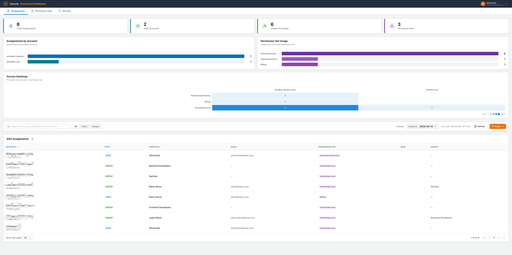
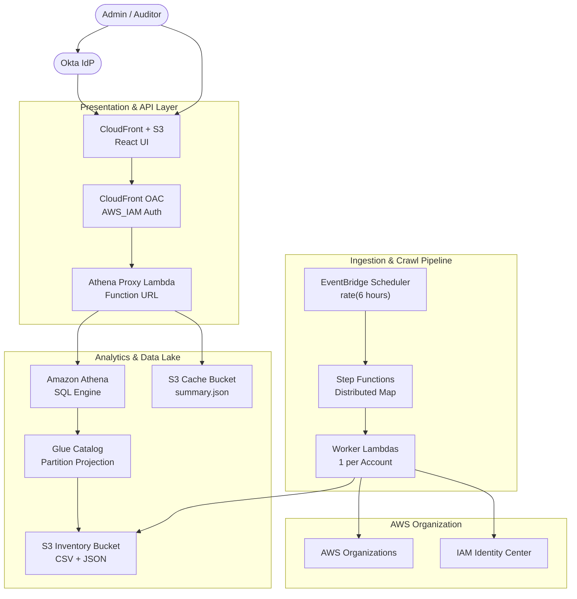

# AWS IAM Identity Center - Security Governance Dashboard

> **A serverless, open-source dashboard to audit IAM Identity Center (SSO) permission assignments, permission set configurations, and security risks across your entire AWS Organization — deployed in minutes with Terraform.**

<p align="center">
  
</p>

[](LICENSE)
[](https://www.terraform.io/)
[](https://aws.amazon.com/)
[](https://www.python.org/)
[](https://react.dev/)
[](https://github.com/alfredkzr/aws-iam-identity-center-security-governance-dashboard/pulls)

---

## Table of Contents

- [Overview](#overview)
- [Architecture](#architecture)
- [Features](#features)
- [Dashboard Usage](#dashboard-usage)
- [Prerequisites](#prerequisites)
- [Quick Start](#quick-start)
- [Okta SSO Setup](#okta-sso-setup)
- [Configuration Reference](#configuration-reference)
- [Project Structure](#project-structure)
- [Security](#security)
- [IAM Permissions Reference](#iam-permissions-reference)
- [Data Schema](#data-schema)
- [API Reference](#api-reference)
- [Cost Estimate](#cost-estimate)
- [Troubleshooting](#troubleshooting)
- [Contributing](#contributing)
- [Uninstalling](#uninstalling)
- [License](#license)

---

## Overview

The **AWS IAM Identity Center - Security Governance Dashboard** gives security teams and auditors a single-pane view of _who has access to what_, _what each permission set contains_, and _which permission sets are high-risk_ across every account in an AWS Organization.

It crawls IAM Identity Center assignments and permission set configurations on a configurable schedule (every 6 hours by default), evaluates them against customisable security risk rules (based on CIS and Rhino Security research), stores structured snapshots in S3, and surfaces everything through an interactive React UI — all without managing servers.

**Built for teams who need:**
- Continuous visibility into SSO permission sprawl and permission set configurations
- Automated risk scoring to highlight privilege escalation paths and over-permissioned access
- Audit-ready exports of assignments and permission set details across hundreds of accounts
- A zero-maintenance, cost-optimised setup (~$0.10-$5/month)

---

## Architecture



**Data flow:**
1. **Crawl** — EventBridge triggers Step Functions on a schedule. Worker Lambdas crawl each AWS account's assignments in parallel via Distributed Map, then crawl all permission set details. Results are written to S3 as Hive-partitioned CSV and JSON.
2. **Query** — Athena queries the data via Glue Catalog (partition projection, no Glue Crawlers). The Athena Proxy Lambda serves a cached `summary.json` from S3 first, falling back to Athena SQL on cache miss.
3. **Display** — The React SPA is served from S3 via CloudFront. API requests go through CloudFront's `/api*` path behaviour to the Athena Proxy Lambda Function URL (secured with CloudFront OAC + AWS_IAM auth).

---

## Features

| Feature | Description |
|---------|-------------|
| **Full Org Crawl** | Discovers all accounts in your AWS Organization and audits IAM Identity Center assignments and permission sets |
| **Security Risk Scoring** | Evaluates permission sets against customisable rules (based on CIS/Rhino Security) to flag privilege escalation paths |
| **Distributed Processing** | Step Functions Distributed Map runs one Lambda per account in parallel |
| **User & Group Resolution** | Resolves GUIDs to friendly names, emails, and expanded group memberships |
| **Permission Set Deep Dive** | AWS managed policies, customer managed policies, inline policies, permissions boundaries, session duration, tags, and provisioning status |
| **Dark / Light Mode** | Theme toggle with OS preference detection and localStorage persistence |
| **Fast-Load Cache** | Pre-rendered `summary.json` served from S3 before falling back to Athena SQL |
| **SSO-Secured Frontend** | Okta OIDC (Authorization Code + PKCE) with server-side token validation — falls back to local auth for development |
| **Interactive Tables** | Resizable columns, multi-column sorting, full-text search, pagination, and colour-coded policy labels |
| **Export** | Download any table view to CSV or print to PDF with a single click |
| **AWS Console Deep Links** | Permission set names link directly to their detail page in the IAM Identity Center console |
| **Access Heatmap** | Visualises principal-count per account x permission set matrix with colour intensity |
| **Historical Snapshots** | Browse and compare past crawl snapshots via the date selector |
| **Cost-Optimised** | No Glue Crawlers, no NAT Gateways, auto-expiry lifecycle policies, fully serverless |
| **Security Hardened** | AES-256 encryption, CloudFront OAC, SQL injection prevention, query allowlist, IAM least-privilege |

---

## Dashboard Usage

The dashboard has three main tabs:

### Assignments Tab

Shows every SSO assignment in your organisation — which principal (user or group) has which permission set in which account.

- **Search & filter** by principal name, account, or permission set using the toolbar
- **Sort** by any column header (click to toggle ascending/descending)
- **Snapshot selector** lets you browse historical crawl dates
- **Access Heatmap** at the bottom shows principal counts per account x permission set — hover a cell for exact numbers
- **Export** the visible assignments to CSV or PDF via the export dropdown

### Permission Sets Tab

Provides a full breakdown of every permission set configuration.

- **Columns:** Name (with AWS Console link), Description, Provisioned (account count), Session Duration, Policies (AWS managed + customer managed), Boundary, Inline Policy (expandable JSON viewer), Tags
- **Policy labels:** AWS managed policies appear as blue links to AWS documentation; customer managed policies are highlighted with a yellow badge
- **Inline Policy:** click the `{ }` button to expand a syntax-highlighted JSON viewer inline
- **Resizable columns:** drag the divider on any column header to resize
- **Legend bar** below the header explains colour-coding and available interactions

### Security Tab

Provides risk scoring and an interactive policy rule editor.

- **Risk Overview:** Summary cards showing how many permission sets fall into Critical, High, Medium, and Low risk categories
- **Flagged Permission Sets:** All permission sets flagged above "Low" risk, with exactly which rules they matched and why
- **Rule Editor:** Add, edit, or delete custom risk rules based on managed policy names or inline policy actions (supports exact and wildcard matching)
- **Export:** Download the risk policy rules to CSV or print to PDF
- **Default Fallback:** Ships with industry-standard rules out of the box (restorable at any time)

---

## Prerequisites

| Requirement | Version / Detail |
|-------------|------------------|
| **AWS Account** | IAM Identity Center enabled with AWS Organizations |
| **Terraform** | >= 1.5 |
| **Node.js** | >= 18 |
| **Python** | 3.12 (for Lambda runtime) |
| **AWS CLI** | v2, configured with credentials that can deploy infrastructure |

### Information You'll Need

| Value | Where to Find It |
|-------|-------------------|
| `sso_instance_arn` | AWS Console -> IAM Identity Center -> Settings -> ARN |
| `identity_store_id` | AWS Console -> IAM Identity Center -> Settings -> Identity source |
| `resource_prefix` | You choose this — must be globally unique (used in S3 bucket names) |

### Required Deployer Permissions

The IAM principal running `terraform apply` needs permissions to create and manage:

| Service | Resources Created |
|---------|-------------------|
| **S3** | 4 buckets (inventory, cache, athena-results, frontend) |
| **Lambda** | 2 functions (worker, athena-proxy) + Function URL |
| **IAM** | 4 roles + policies (worker, proxy, step-functions, scheduler) |
| **Step Functions** | 1 state machine (Standard type) |
| **Athena** | 1 workgroup |
| **Glue** | 1 database + 2 tables (catalog only, no crawlers) |
| **CloudFront** | 1 distribution + OAC |
| **EventBridge** | 1 scheduler rule |
| **CloudWatch Logs** | 3 log groups |

---

## Quick Start

### 1. Clone the Repository

```bash
git clone https://github.com/alfredkzr/aws-iam-identity-center-security-governance-dashboard.git
cd aws-iam-identity-center-security-governance-dashboard
```

### 2. Configure Variables

```bash
cp terraform.tfvars.example terraform/terraform.tfvars
```

Open `terraform/terraform.tfvars` and set the three required values:

```hcl
aws_region        = "us-east-1"
resource_prefix   = "myorg-idc-gov"          # Must be globally unique
sso_instance_arn  = "arn:aws:sso:::instance/ssoins-xxxxxxxx"
identity_store_id = "d-xxxxxxxxxx"
```

### 3. Deploy

```bash
cd terraform
terraform init
terraform plan     # Review planned changes
terraform apply    # Deploy everything
```

Terraform will automatically:
1. Provision all AWS infrastructure (S3, Lambda, Athena, CloudFront, Step Functions)
2. Build the React frontend with correct API endpoint injected
3. Upload the build to S3 and invalidate the CloudFront cache

The `frontend_url` output is your dashboard URL:

```
Outputs:
  frontend_url = "https://d1234abcde.cloudfront.net"
```

> **Note:** First-time CloudFront distribution creation takes ~5-10 minutes. Subsequent deploys propagate within 1-2 minutes.

### 4. Run the Initial Crawl

Trigger the Step Functions state machine to populate the dashboard:

```bash
aws stepfunctions start-execution \
  --region $(terraform output -raw aws_region) \
  --state-machine-arn $(terraform output -raw step_functions_arn)
```

The dashboard will populate within **1-3 minutes**. Subsequent crawls run automatically on the configured schedule (every 6 hours by default).

### 5. Access the Dashboard

Open the `frontend_url` from the Terraform output. Without Okta configured, use the default local credentials:

- **Username:** `admin`
- **Password:** `admin123`

To use custom credentials, set them in `terraform/terraform.tfvars`:

```hcl
local_admin_username = "myuser"
local_admin_password = "mysecurepassword"
```

Then redeploy with `terraform apply`.

> **Warning:** Always configure Okta SSO or change the default credentials before exposing the dashboard publicly. See [Okta SSO Setup](#okta-sso-setup).

---

## Okta SSO Setup

> [!IMPORTANT]
> **Without Okta configured**, the dashboard uses local auth mode with default credentials (`admin` / `admin123`). You can customise these via the `local_admin_username` and `local_admin_password` Terraform variables or `REACT_APP_LOCAL_ADMIN_USERNAME` / `REACT_APP_LOCAL_ADMIN_PASSWORD` env vars. **Always configure Okta or change the defaults before production use.**

### 1. Create an Okta Application

1. Log into your [Okta Admin Console](https://your-org-admin.okta.com/admin/apps/active)
2. Go to **Applications -> Create App Integration**
3. Select **OIDC - OpenID Connect** -> **Single-Page Application (SPA)**
4. Click **Next**

### 2. Configure Redirect URIs

| Setting | Value |
|---------|-------|
| **App name** | `IAM Governance Dashboard` |
| **Grant type** | Authorization Code |
| **Sign-in redirect URI** (dev) | `http://localhost:3000/callback` |
| **Sign-in redirect URI** (prod) | `https://your-cloudfront-domain.cloudfront.net/callback` |
| **Sign-out redirect URI** (dev) | `http://localhost:3000` |
| **Sign-out redirect URI** (prod) | `https://your-cloudfront-domain.cloudfront.net` |

Click **Save**, then copy the **Client ID** from the General tab.

### 3. Set Terraform Variables

Add to `terraform/terraform.tfvars`:

```hcl
okta_domain    = "your-org.okta.com"
okta_client_id = "0oaXXXXXXXXXXXXXXXXX"
```

Then redeploy:

```bash
cd terraform && terraform apply
```

The redirect URI is auto-derived from the CloudFront domain — no manual configuration needed in Terraform. After deploying, add the production callback URL (`https://<cloudfront-domain>/callback`) to your Okta app's **Sign-in redirect URIs**.

### 4. Local Development with Okta

Create `frontend/.env`:

```bash
REACT_APP_OKTA_DOMAIN=your-org.okta.com
REACT_APP_OKTA_CLIENT_ID=0oaXXXXXXXXXXXXXXXXX
REACT_APP_OKTA_REDIRECT_URI=http://localhost:3000/callback
```

**How it works:** The frontend uses Authorization Code + PKCE flow. Tokens are stored in `sessionStorage`. The backend validates tokens by calling Okta's `/oauth2/default/v1/userinfo` endpoint (with in-memory caching). Tokens are passed via the `X-Auth-Token` header instead of `Authorization` because CloudFront OAC replaces the `Authorization` header with its own SigV4 signature.

---

## Configuration Reference

### Required Variables

| Variable | Type | Description |
|----------|------|-------------|
| `resource_prefix` | `string` | Prefix for all resource names (3-31 chars, lowercase alphanumeric + hyphens, globally unique for S3) |
| `sso_instance_arn` | `string` | ARN of your IAM Identity Center instance |
| `identity_store_id` | `string` | Identity Store ID associated with the SSO instance |

### Optional Variables

| Variable | Type | Default | Description |
|----------|------|---------|-------------|
| `aws_region` | `string` | `"us-east-1"` | AWS deployment region |
| `project_name` | `string` | `"idc-governance"` | Tag applied to all resources |
| `environment` | `string` | `"production"` | Environment tag |
| `okta_domain` | `string` | `""` | Okta domain (e.g. `your-org.okta.com`) |
| `okta_client_id` | `string` | `""` | Okta OIDC client ID |
| `local_admin_username` | `string` | `"admin"` | Username for local dashboard login (when Okta is not configured) |
| `local_admin_password` | `string` | `"admin123"` | Password for local dashboard login (when Okta is not configured, sensitive) |

### Schedule & Lifecycle

| Variable | Type | Default | Description |
|----------|------|---------|-------------|
| `crawler_schedule_interval` | `string` | `"6 hours"` | How often the crawler runs (EventBridge rate syntax: `"6 hours"`, `"1 day"`, `"12 hours"`) |
| `inventory_lifecycle_days` | `number` | `7` | Days before raw CSV/JSON snapshots auto-delete from S3 |
| `athena_results_lifecycle_days` | `number` | `1` | Days before Athena query results auto-delete |
| `cache_lifecycle_days` | `number` | `1` | Days before cached API responses auto-delete |
| `log_retention_days` | `number` | `7` | CloudWatch Logs retention period (days) |

### Performance & Cost Controls

| Variable | Type | Default | Description |
|----------|------|---------|-------------|
| `worker_reserved_concurrency` | `number` | `10` | Max concurrent worker Lambda executions (limits blast radius) |
| `athena_proxy_reserved_concurrency` | `number` | `5` | Max concurrent API Lambda executions |
| `force_destroy_buckets` | `bool` | `false` | Allow `terraform destroy` to delete non-empty S3 buckets (dev/demo only) |

---

## Project Structure

```
aws-iam-identity-center-security-governance-dashboard/
├── terraform/                         # Infrastructure as Code
│   ├── main.tf                        # Provider & backend configuration
│   ├── variables.tf                   # All configurable input variables
│   ├── outputs.tf                     # Terraform outputs (URLs, ARNs, bucket names)
│   ├── s3.tf                          # S3 buckets (inventory, cache, athena-results)
│   ├── frontend_hosting.tf            # S3 + CloudFront + OAC (auto-builds & deploys frontend)
│   ├── lambda.tf                      # Lambda functions (worker + athena proxy) + Function URL
│   ├── iam.tf                         # IAM roles & policies (least privilege)
│   ├── athena.tf                      # Athena workgroup + Glue catalog (partition projection)
│   ├── stepfunctions.tf               # Step Functions state machine (3-phase crawler)
│   └── eventbridge.tf                 # EventBridge scheduled trigger
├── backend/
│   ├── worker/                        # Crawler Lambda (Python 3.12, ARM64)
│   │   ├── handler.py                 # Lambda handler (list accounts, crawl assignments, crawl permission sets)
│   │   └── default_risk_policies.py   # Default risk scoring rules
│   └── athena_proxy/                  # API Lambda (Python 3.12, ARM64)
│       ├── handler.py                 # Lambda handler (query, cache, token validation)
│       └── default_risk_policies.py   # Default risk scoring rules (must stay in sync with worker/)
├── frontend/                          # React 18 SPA (plain JavaScript, no TypeScript)
│   ├── public/
│   │   └── index.html                 # HTML shell with FOUC-prevention theme script
│   └── src/
│       ├── App.js                     # Main app (tabs, data fetching, demo data fallback)
│       ├── index.css                  # Design system (CSS custom properties, light + dark themes)
│       ├── auth/
│       │   └── AuthContext.js         # Okta OIDC + PKCE + local auth fallback
│       ├── hooks/
│       │   └── useTheme.js            # Dark/light mode hook (localStorage + OS preference)
│       └── components/
│           ├── Header.js              # Top navigation + theme toggle
│           ├── LoginPage.js           # Authentication page
│           ├── Dashboard.js           # Assignments tab (table, toolbar, stats)
│           ├── GovernanceCharts.js     # Visualisations (bar charts, access heatmap)
│           ├── PermissionSetsTable.js  # Permission sets tab (resizable, expandable)
│           └── SecurityTab.js         # Security risk tab (scoring, rule editor)
├── terraform.tfvars.example           # Configuration template — copy to terraform/terraform.tfvars
└── README.md
```

---

## Security

### Built-in Controls

The default deployment includes these security controls out of the box:

| Control | Detail |
|---------|--------|
| **S3 Encryption** | All buckets use AES-256 server-side encryption with bucket keys |
| **Public Access Blocked** | All S3 buckets block public ACLs, public policies, and restrict public access |
| **CloudFront OAC** | Origin Access Control secures both S3 and Lambda Function URL origins with SigV4 |
| **AWS_IAM Auth** | Lambda Function URL requires IAM authorization — no anonymous access |
| **Okta Token Validation** | Backend validates tokens against Okta's userinfo endpoint (with in-memory cache) |
| **SQL Injection Prevention** | Table names validated with regex `^[a-zA-Z_][a-zA-Z0-9_]*$` |
| **Query Type Allowlist** | API only accepts: `all`, `summary`, `dates`, `permission_sets`, `permission_sets_dates`, `risk_policies`, `save_risk_policies` |
| **Least-Privilege IAM** | All Lambda roles scoped to exactly the required actions and resources |
| **Auto-Expiry Lifecycle** | S3 objects auto-delete (inventory: 7d, results: 1d, cache: 1d) |
| **Reserved Concurrency** | Lambda concurrency limits control blast radius and cost |
| **PKCE Flow** | Frontend uses Authorization Code + PKCE (no client secret in browser) |
| **Session Storage** | Auth tokens stored in `sessionStorage` (cleared on tab close) |

### Recommended Post-Deployment Hardening

| Action | Why | How |
|--------|-----|-----|
| **Configure Okta SSO** | Replace local demo credentials with production IdP | See [Okta SSO Setup](#okta-sso-setup) |
| **Change default credentials** | Replace default `admin/admin123` with strong credentials | Set `local_admin_username` and `local_admin_password` in `terraform/terraform.tfvars` |
| **Attach AWS WAFv2** | Protect against DDoS, bots, OWASP Top 10 | Create `aws_wafv2_web_acl` with AWS Managed Rules, associate with CloudFront |
| **Add custom domain + TLS** | Replace `*.cloudfront.net` with your branded domain | ACM certificate in `us-east-1` + Route 53 alias + `viewer_certificate` block |
| **Enable geo-restriction** | Limit access to operating regions | `restrictions.geo_restriction` in CloudFront |
| **Add security headers** | HSTS, X-Frame-Options, CSP | `aws_cloudfront_response_headers_policy` with security headers |
| **Restrict CORS** | Lock down API to your domain only | Update CORS headers in Athena Proxy handler |

---

## IAM Permissions Reference

These are the exact IAM permissions the deployed tool uses at runtime (not what the deployer needs). All roles follow least privilege.

### Worker Lambda

Crawls assignments and permission sets from IAM Identity Center.

```
sso:ListAccountAssignments          sso:ListPermissionSets
sso:DescribePermissionSet           sso:ListAccountsForProvisionedPermissionSet
sso:ListManagedPoliciesInPermissionSet
sso:GetInlinePolicyForPermissionSet
sso:ListCustomerManagedPolicyReferencesInPermissionSet
sso:GetPermissionsBoundaryForPermissionSet
sso:ListTagsForResource
identitystore:DescribeUser          identitystore:DescribeGroup
identitystore:ListGroupMemberships
organizations:ListAccounts          organizations:DescribeAccount
s3:PutObject                        s3:GetObject (inventory bucket only)
logs:CreateLogGroup/Stream          logs:PutLogEvents
```

### Athena Proxy Lambda

Serves the API, queries Athena, manages cache.

```
athena:StartQueryExecution           athena:GetQueryExecution
athena:GetQueryResults               athena:StopQueryExecution
glue:GetTable     glue:GetDatabase   glue:GetPartitions
glue:GetDatabases glue:GetTables
s3:GetObject  s3:PutObject  s3:ListBucket  s3:GetBucketLocation
  (inventory, athena-results, and cache buckets)
logs:CreateLogGroup/Stream           logs:PutLogEvents
```

### Step Functions

Orchestrates the 3-phase crawl workflow.

```
lambda:InvokeFunction (worker Lambda only)
organizations:ListAccounts
states:StartExecution  states:DescribeExecution  states:StopExecution
logs:CreateLogDelivery  logs:PutResourcePolicy  logs:DescribeLogGroups
```

---

## Data Schema

### Assignments Table (CSV, Hive-partitioned)

**S3 path:** `s3://{inventory_bucket}/assignments/snapshot_date=YYYY-MM-DD/{account_id}.csv`

| Column | Type | Description |
|--------|------|-------------|
| `account_id` | string | AWS account ID |
| `account_name` | string | AWS account name |
| `principal_type` | string | `USER`, `GROUP`, or `USER_VIA_GROUP` |
| `principal_id` | string | Identity Store principal ID |
| `principal_name` | string | Resolved display name |
| `principal_email` | string | Email address (empty for groups) |
| `permission_set_name` | string | Permission set name |
| `permission_set_arn` | string | Permission set ARN |
| `group_name` | string | Group name (if user is assigned via group) |
| `created_date` | string | Assignment creation date |

### Permission Sets Table (JSON, Hive-partitioned)

**S3 path:** `s3://{inventory_bucket}/permission_sets/snapshot_date=YYYY-MM-DD/permission_sets.json`

| Field | Type | Description |
|-------|------|-------------|
| `name` | string | Permission set name |
| `arn` | string | Permission set ARN |
| `description` | string | Description |
| `session_duration` | string | ISO 8601 duration (e.g. `PT4H`) |
| `created_date` | string | Creation timestamp |
| `aws_managed_policies` | array | List of `{name, arn}` objects |
| `customer_managed_policies` | array | List of `{name, path}` objects |
| `inline_policy` | string | JSON policy document (stringified) |
| `permissions_boundary` | object | Boundary policy reference (or null) |
| `tags` | array | List of `{Key, Value}` objects |
| `provisioned_accounts` | number | Number of accounts this set is provisioned to |

Both tables use Glue partition projection — no Glue Crawlers needed, partitions are auto-discovered.

---

## API Reference

**Base URL:** `https://{cloudfront_domain}/api`

All requests require the `X-Auth-Token` header (Okta access token) when Okta is configured.

| Parameter | Required | Description |
|-----------|----------|-------------|
| `type` | Yes | Query type (see below) |
| `date` | No | Snapshot date `YYYY-MM-DD` (defaults to latest) |
| `force` | No | Set to `true` to bypass cache and query Athena directly |

### Query Types

| Type | Method | Description |
|------|--------|-------------|
| `all` | GET | All assignments for a snapshot date |
| `summary` | GET | Aggregated stats (cached) |
| `dates` | GET | Available assignment snapshot dates |
| `permission_sets` | GET | All permission sets for a snapshot date |
| `permission_sets_dates` | GET | Available permission set snapshot dates |
| `risk_policies` | GET | Current risk policy rules (custom or defaults) |
| `save_risk_policies` | POST | Save custom risk policy rules (JSON body) |

### Response Format

All responses return JSON with CORS headers. Successful responses include the requested data. Error responses return `{"error": "message"}` with appropriate HTTP status codes.

### Caching Behaviour

The proxy checks S3 for a cached `summary.json` before querying Athena. Cache TTL is 1 hour. Use `force=true` to bypass.

---

## Cost Estimate

Fully serverless — **you only pay when things run.** No fixed costs (no NAT Gateways, no RDS, no Glue Crawlers).

| Service | Role | Cost Driver |
|---------|------|-------------|
| **Step Functions** | Crawl orchestration | State transitions (biggest cost at scale) |
| **Lambda** | Crawl + API | Invocation count + duration |
| **S3** | Storage | Object count + storage (minimal with lifecycle) |
| **Athena** | SQL queries | Per TB scanned (typically KB-MB range) |
| **CloudFront** | CDN + API gateway | Data transfer out (cache hits are free) |
| **EventBridge** | Scheduler | Negligible (4 invocations/day) |
| **CloudWatch** | Logs | Retention-based (default: 7 days) |

### Estimated Monthly Cost

| Scale | Accounts | Crawls/Day | Estimated Cost |
|-------|----------|------------|----------------|
| **Small** | 20 | 4 | **~$0.10** |
| **Medium** | 100 | 4 | **~$0.50** |
| **Large** | 500 | 4 | **~$2.75** |

> Most small-to-medium deployments fall within the **AWS Free Tier**.

**Reduce costs further:** Set `crawler_schedule_interval = "1 day"` to crawl once daily instead of 4x. This cuts Step Functions costs by ~75% — a 500-account org drops to **~$0.70/month**.

---

## Troubleshooting

### Dashboard shows "No data" after deployment

The dashboard needs at least one completed crawl. Trigger it manually:

```bash
aws stepfunctions start-execution \
  --region $(terraform output -raw aws_region) \
  --state-machine-arn $(terraform output -raw step_functions_arn)
```

Wait 1-3 minutes, then refresh the dashboard.

### Crawl fails with permission errors

Ensure the AWS account where you deploy has IAM Identity Center enabled and the `sso_instance_arn` and `identity_store_id` are correct. Check the Worker Lambda CloudWatch logs:

```bash
aws logs tail /aws/lambda/<resource_prefix>-worker --follow
```

### 403 Forbidden on CloudFront

This is normal during the first deployment — CloudFront takes 5-10 minutes to propagate. If it persists, check that the S3 bucket policy allows CloudFront OAC access (Terraform manages this automatically).

### "Authenticating..." spinner never resolves

Clear `sessionStorage` in your browser (DevTools -> Application -> Session Storage -> Clear). This removes stale tokens.

### Athena query timeout

The Athena Proxy Lambda has a 60-second timeout. For very large organisations (1000+ accounts), the first query after a crawl may take longer as Athena scans new partitions. Subsequent queries use the cache and return instantly.

### How do I check crawl status?

```bash
aws stepfunctions list-executions \
  --region $(terraform output -raw aws_region) \
  --state-machine-arn $(terraform output -raw step_functions_arn) \
  --max-results 5
```

---

## Contributing

Contributions are welcome! Here's how to get started.

### Local Development Setup

**Frontend (React):**

```bash
cd frontend
npm install
npm start              # Dev server at http://localhost:3000
```

> Without Okta env vars, local auth is used. Default credentials: `admin` / `admin123`. Customise via `REACT_APP_LOCAL_ADMIN_USERNAME` / `REACT_APP_LOCAL_ADMIN_PASSWORD` in `frontend/.env` (see `frontend/.env.example`).

**Backend (Python Lambdas):**

```bash
cd backend/worker && python3 -c "import handler"
cd ../athena_proxy && python3 -c "import handler"
```

**Infrastructure:**

```bash
cd terraform
terraform fmt          # Format HCL
terraform validate     # Validate configuration
terraform plan         # Preview changes
```

### Code Conventions

- **Frontend:** React 18, plain JavaScript (no TypeScript), plain hooks (`useState`, `useCallback`, `useEffect` — no Redux)
- **Backend:** Python 3.12, boto3 only (no pip dependencies), always use boto3 paginators
- **Terraform:** All resources prefixed with `resource_prefix` variable, no hardcoded Account IDs or ARNs
- **FinOps rule:** No services with fixed costs (no NAT Gateways, no Glue Crawlers, no RDS)
- **Risk policies:** `default_risk_policies.py` is duplicated in both `backend/worker/` and `backend/athena_proxy/` — changes must be applied to **both** copies

### Submitting Changes

1. Fork the repository
2. Create a feature branch: `git checkout -b feature/your-feature`
3. Commit your changes: `git commit -m 'feat: add your feature'`
4. Push: `git push origin feature/your-feature`
5. Open a Pull Request

### Reporting Issues

Please [open an issue](https://github.com/alfredkzr/aws-iam-identity-center-security-governance-dashboard/issues) with:
- A clear description of the problem
- Steps to reproduce
- Expected vs actual behaviour
- Relevant logs or Terraform output

---

## Uninstalling

To remove all deployed resources:

1. First, enable bucket destruction (required for non-empty S3 buckets):

```bash
# Add to terraform/terraform.tfvars
force_destroy_buckets = true
```

2. Apply the change, then destroy:

```bash
cd terraform
terraform apply        # Applies the force_destroy flag
terraform destroy      # Removes all resources
```

> **Note:** CloudFront distributions can take 10-15 minutes to fully delete. Terraform will wait for this automatically.

---

## License

[MIT](LICENSE) — free to use, modify, and distribute.
