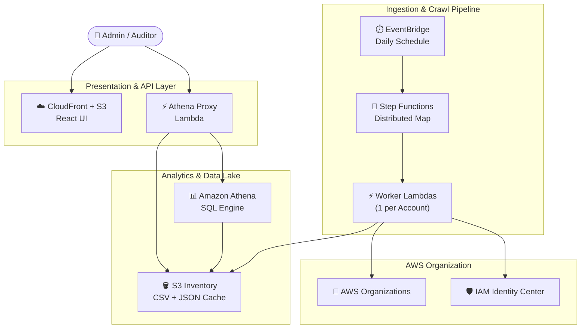

# AWS IAM Identity Center Governance Dashboard

> **A serverless, open-source dashboard to audit IAM Identity Center (SSO) permission assignments across your entire AWS Organization — deployed in minutes with Terraform.**

[](https://opensource.org/licenses/MIT)
[](https://www.terraform.io/)
[](https://aws.amazon.com/)
[](CONTRIBUTING.md)

---

## Table of Contents

- [Overview](#overview)
- [Architecture](#architecture)
- [Features](#features)
- [Prerequisites](#prerequisites)
- [Quick Start](#quick-start)
- [Okta SSO Setup](#okta-sso-setup)
- [Configuration Reference](#configuration-reference)
- [Project Structure](#project-structure)
- [Security](#security)
- [Cost Estimate](#cost-estimate)
- [Contributing](#contributing)
- [License](#license)

---

## Overview

The **AWS IAM Identity Center Governance Dashboard** gives security teams and auditors a single-pane view of _who has access to what_ across every account in an AWS Organization. It crawls IAM Identity Center assignments daily, stores structured snapshots in S3, and surfaces them through an interactive React UI — all without managing servers.

**Built for teams who need:**
- Continuous visibility into SSO permission sprawl
- Audit-ready exports of assignments across hundreds of accounts
- A zero-maintenance, cost-optimized setup (~$0.10–$5/month)

---

## Architecture



> **Data flow:** EventBridge triggers Step Functions daily → Worker Lambdas crawl each AWS account in parallel → results are written to S3 → Athena queries the data → the React UI displays assignments via the Athena Proxy Lambda.

---

## Features

| Feature | Description |
|---------|-------------|
| 🏢 **Full Org Crawl** | Discovers all accounts in your AWS Organization and audits IAM Identity Center assignments |
| ⚡ **Distributed Processing** | Step Functions Distributed Map runs one Lambda per account in parallel |
| 👤 **User & Group Resolution** | Resolves GUIDs to friendly names, emails, and expanded group memberships |
| 🚀 **Fast-Load Cache** | Athena Proxy serves pre-rendered `summary.json` from S3 before falling back to SQL |
| 🔐 **SSO-Secured Frontend** | React dashboard protected by Okta OIDC — falls back to local auth for development |
| 💰 **Cost-Optimized** | No Glue Crawlers, 24-hour lifecycle policies, fully serverless |
| 🛡️ **Security Hardened** | AES-256 encryption at rest, configurable CORS, input validation, concurrency guardrails |

---

## Prerequisites

Before you begin, ensure you have:

| Requirement | Version |
|-------------|---------|
| AWS Account | IAM Identity Center enabled |
| Terraform | `>= 1.5` |
| Node.js | `>= 18` |
| Python | `3.12` |
| AWS CLI | Configured with appropriate credentials |

### Required IAM Permissions

The IAM principal running `terraform apply` needs permissions for:

| Service | Actions |
|---------|---------|
| S3 | Create and manage buckets |
| Lambda | Create and manage functions |
| IAM | Create roles and policies |
| Step Functions | Create state machines |
| Athena & Glue | Create workgroups, databases, tables |
| CloudFront | Create distributions |
| CloudWatch Logs | Create log groups |

---

## Quick Start

### 1. Clone the Repository

```bash
git clone https://github.com/alfredkzr/aws-iam-identity-center-governance-dashboard.git
cd aws-iam-identity-center-governance-dashboard
```

### 2. Configure Variables

```bash
cp terraform.tfvars.example terraform/terraform.tfvars
```

Open `terraform/terraform.tfvars` and set these required values:

| Variable | Description | Example |
|----------|-------------|---------|
| `resource_prefix` | Unique prefix for all resources (used in S3 names) | `myorg-idc-gov` |
| `sso_instance_arn` | ARN of your IAM Identity Center instance | `arn:aws:sso:::instance/ssoins-xxxxxxxx` |
| `identity_store_id` | Identity Store ID | `d-xxxxxxxxxx` |

> **Where to find these:** AWS Console → **IAM Identity Center** → **Settings**

### 3. Deploy Infrastructure

```bash
cd terraform
terraform init
terraform plan     # Review planned changes
terraform apply
```

Terraform will automatically:
1. Provision all AWS infrastructure (S3, Lambda, Athena, CloudFront, Step Functions)
2. Build the React frontend with correct environment variables injected
3. Upload the build to S3 and invalidate the CloudFront distribution

The `frontend_url` output will be your dashboard URL:

```
Outputs:
  frontend_url = "https://d1234abcde.cloudfront.net"
```

> ⏱️ The first CloudFront deployment takes ~5 minutes to propagate globally.

### 4. Run the Initial Crawl

Trigger the Step Functions state machine to populate the dashboard with your first snapshot:

```bash
aws stepfunctions start-execution \
  --region $(terraform -chdir=terraform output -raw aws_region) \
  --state-machine-arn $(terraform -chdir=terraform output -raw step_functions_arn)
```

The dashboard will populate within **1–3 minutes** once the crawl completes. Subsequent crawls run automatically on the daily EventBridge schedule.

---

## Okta SSO Setup

The dashboard supports Okta OIDC authentication. If Okta is not configured, it falls back to local username/password auth (suitable for development only).

### 1. Create an Okta Application

1. Log into your [Okta Admin Console](https://your-org-admin.okta.com/admin/apps/active)
2. Go to **Applications → Create App Integration**
3. Select **OIDC – OpenID Connect** → **Single-Page Application (SPA)**
4. Click **Next**

### 2. Configure Redirect URIs

| Setting | Value |
|---------|-------|
| **App name** | `IAM Governance Dashboard` |
| **Grant type** | Authorization Code |
| **Sign-in redirect URI** (dev) | `http://localhost:3000/callback` |
| **Sign-in redirect URI** (prod) | `https://your-cloudfront-domain.cloudfront.net/callback` |
| **Sign-out redirect URI** (dev) | `http://localhost:3000` |
| **Sign-out redirect URI** (prod) | `https://your-cloudfront-domain.cloudfront.net` |

Click **Save**, then copy the **Client ID** from the General tab.

### 3. Set Environment Variables

**For local development**, create `frontend/.env`:

```bash
REACT_APP_OKTA_DOMAIN=your-org.okta.com
REACT_APP_OKTA_CLIENT_ID=0oaXXXXXXXXXXXXXXXXX
REACT_APP_OKTA_REDIRECT_URI=http://localhost:3000/callback
```

**For production**, set values in `terraform/terraform.tfvars` — Terraform injects them at build time:

```hcl
okta_domain    = "your-org.okta.com"
okta_client_id = "0oaXXXXXXXXXXXXXXXXX"
```

> The redirect URI is **auto-derived** from the current CloudFront origin — no manual configuration needed.

After deploying, remember to add the production callback URL to your Okta app's **Sign-in redirect URIs**.

---

## Configuration Reference

### Required Variables

| Variable | Type | Description |
|----------|------|-------------|
| `resource_prefix` | `string` | Prefix for all resource names (must be globally unique for S3) |
| `sso_instance_arn` | `string` | ARN of your IAM Identity Center instance |
| `identity_store_id` | `string` | Identity Store ID |

### Security Variables

| Variable | Type | Default | Description |
|----------|------|---------|-------------|
| `allowed_origins` | `list(string)` | `["*"]` | CORS origins for the API. Update to your CloudFront domain after initial deploy. |
| `lambda_url_auth_type` | `string` | `"NONE"` | `NONE` for demo; `AWS_IAM` for production |
| `force_destroy_buckets` | `bool` | `false` | Allow `terraform destroy` to delete non-empty buckets |

### Cost & Performance Variables

| Variable | Type | Default | Description |
|----------|------|---------|-------------|
| `log_retention_days` | `number` | `7` | CloudWatch Logs retention period |
| `worker_reserved_concurrency` | `number` | `10` | Max concurrent worker Lambda executions |
| `athena_proxy_reserved_concurrency` | `number` | `5` | Max concurrent proxy Lambda executions |

### Optional Variables

| Variable | Type | Default | Description |
|----------|------|---------|-------------|
| `aws_region` | `string` | `ap-southeast-1` | AWS deployment region |
| `project_name` | `string` | `idc-governance` | Tag applied to all resources |
| `environment` | `string` | `production` | Environment tag |
| `okta_domain` | `string` | `""` | Okta domain (e.g. `your-org.okta.com`) |
| `okta_client_id` | `string` | `""` | Okta OIDC client ID |

---

## Project Structure

```
aws-iam-identity-center-governance-dashboard/
├── terraform/                     # Infrastructure as Code
│   ├── main.tf                    # Provider & backend configuration
│   ├── variables.tf               # All configurable input variables
│   ├── outputs.tf                 # Terraform outputs (URLs, ARNs)
│   ├── s3.tf                      # S3 buckets (encrypted, lifecycle policies)
│   ├── frontend_hosting.tf        # S3 + CloudFront (auto-builds & deploys frontend)
│   ├── lambda.tf                  # Lambda functions (worker + athena proxy)
│   ├── iam.tf                     # IAM roles & policies (least privilege)
│   ├── athena.tf                  # Athena workgroup & Glue catalog
│   ├── stepfunctions.tf           # Step Functions state machine
│   └── eventbridge.tf             # EventBridge daily schedule rule
├── backend/
│   ├── worker/                    # Account assignment crawler Lambda (Python)
│   └── athena_proxy/              # Query lifecycle + cache Lambda (Python)
├── frontend/                      # React dashboard (Okta SSO + local auth)
└── terraform.tfvars.example       # Configuration template — copy and fill in
```

---

## Security

### Data at Rest
- All S3 buckets use **AES-256 server-side encryption** (SSE-S3)
- Inventory data auto-expires after **7 days**; Athena results after **1 day**
- All buckets block public access by default

### API Security
- Lambda Function URL defaults to `authorization_type = "NONE"` for quick demo setup
- **For production:** Set `lambda_url_auth_type = "AWS_IAM"` to require SigV4 signed requests
- **For production:** Restrict `allowed_origins` to your CloudFront domain after initial deploy

### Input Validation
- Athena table name validated against `^[a-zA-Z_][a-zA-Z0-9_]*$` at cold-start
- Query type validated against allowlist (`all`, `summary`)
- Error responses never leak internal exception details

### IAM Least Privilege

| Component | Permissions |
|-----------|-------------|
| Worker Lambda | Read-only: SSO, Identity Store, Organizations; Write-only: inventory S3 bucket |
| Athena Proxy Lambda | Athena query execution; Read/write S3; Read-only Glue catalog |
| Step Functions | Invoke worker Lambda only |

---

## Cost Estimate

Fully serverless — **you only pay when things run.**

> **Note on schedule:** The crawler runs every **6 hours by default** (`crawler_schedule_interval = "6 hours"`), meaning **4 full crawls per day / ~120 per month**. Adjust this variable to reduce cost.

### Cost Breakdown by Service

#### ⚡ Lambda (256 MB, ARM64 Graviton)

Each crawl invokes the worker Lambda once per account (up to 10 concurrently).

| Scale | Accounts | Invocations/mo | Avg Duration | GB-seconds/mo | Monthly Cost |
|-------|----------|---------------|-------------|--------------|-------------|
| Small | 20 | ~2,400 | ~10s | ~1,200 | **~$0.02** |
| Medium | 100 | ~12,000 | ~15s | ~9,000 | **~$0.15** |
| Large | 500 | ~60,000 | ~20s | ~75,000 | **~$1.20** |

> AWS Free Tier: 1M requests + 400,000 GB-seconds/month. Small orgs are **free**.

#### 🔀 Step Functions (STANDARD workflow)

STANDARD Step Functions cost **$0.025 per 1,000 state transitions**. Each crawl execution uses `N accounts + 3` state transitions (`ListAccounts` → `CrawlAccounts` Map → N × `ProcessAccount` → `CrawlComplete`).

| Scale | Accounts | Transitions/crawl | Crawls/mo | Transitions/mo | Monthly Cost |
|-------|----------|------------------|-----------|----------------|-------------|
| Small | 20 | 23 | 120 | ~2,760 | **~$0.07** |
| Medium | 100 | 103 | 120 | ~12,360 | **~$0.31** |
| Large | 500 | 503 | 120 | ~60,360 | **~$1.51** |

> ⚠️ **Step Functions is the dominant cost driver** at scale. If running 500 accounts, consider switching `crawler_schedule_interval` to `"1 day"` to reduce to ~$0.38/month.

#### 📊 Athena

Athena charges **$5 per TB scanned**. Each CSV file per account is ~10–100 KB. Partitioning by `snapshot_date` limits scans to the queried date only.

| Scale | CSV size/account | Data scanned/query | Monthly Cost |
|-------|-----------------|-------------------|-------------|
| Small | ~10 KB | ~200 KB | **< $0.01** |
| Medium | ~50 KB | ~5 MB | **< $0.01** |
| Large | ~200 KB | ~100 MB | **< $0.01** |

> Athena cost is negligible at all scales due to partition projection.

#### 🌩️ CloudFront + S3

| Resource | Cost |
|----------|------|
| S3 storage (tiny CSVs, 7-day lifecycle) | **< $0.01/mo** |
| CloudFront (low-traffic internal tool) | **~$0.01–$0.05/mo** |
| S3 PUT/GET requests | **< $0.01/mo** |

#### 📋 Other Services (Effectively Free)

| Service | Why Free |
|---------|---------|
| EventBridge Scheduler | First 14M invocations/mo free |
| Glue Data Catalog | Free for < 1M objects |
| CloudWatch Logs (7-day retention) | Minimal log volume |
| Lambda Function URL | No additional charge |

### Monthly Cost Summary

| Scale | Accounts | Crawls/day | Lambda | Step Functions | Athena | CloudFront + S3 | **Total** |
|-------|----------|-----------|--------|---------------|--------|----------------|---------|
| Small | 20 | 4 | ~$0.02 | ~$0.07 | < $0.01 | ~$0.02 | **~$0.11** |
| Medium | 100 | 4 | ~$0.15 | ~$0.31 | < $0.01 | ~$0.02 | **~$0.49** |
| Large | 500 | 4 | ~$1.20 | ~$1.51 | < $0.01 | ~$0.02 | **~$2.74** |
| Large | 500 | 1 | ~$0.30 | ~$0.38 | < $0.01 | ~$0.02 | **~$0.71** |

### Cost Optimization Tips

- **Reduce crawl frequency**: Set `crawler_schedule_interval = "1 day"` to cut Step Functions costs by 4×
- **Fewer accounts**: Use concurrency limits (`worker_reserved_concurrency`) to throttle parallel execution
- **Cache hits**: The `summary.json` fast-load cache means most UI loads never hit Athena

---

## Contributing

Contributions are welcome and appreciated! Here's how to get started:

### Submitting Changes

1. Fork the repository
2. Create a feature branch: `git checkout -b feature/your-feature`
3. Commit your changes: `git commit -m 'Add your feature'`
4. Push: `git push origin feature/your-feature`
5. Open a Pull Request

### Local Development Setup

**Frontend (React):**

```bash
cd frontend
npm install
npm start          # Runs dev server at http://localhost:3000
```

> Without Okta env vars configured, local auth is used. Default credentials: `admin` / `admin123`

**Backend (Python Lambdas):**

```bash
cd backend/worker
python3 -c "import handler"        # Verify imports resolve correctly

cd ../athena_proxy
python3 -c "import handler"        # Verify imports resolve correctly
```

**Infrastructure:**

```bash
cd terraform
terraform fmt      # Format HCL files
terraform validate # Validate configuration
terraform plan     # Preview changes before applying
```

### Reporting Issues

Please [open an issue](https://github.com/alfredkzr/aws-iam-identity-center-governance-dashboard/issues) with:
- A clear description of the problem
- Steps to reproduce
- Expected vs actual behavior
- Relevant logs or Terraform output

---

## License

[MIT](LICENSE) — free to use, modify, and distribute.
