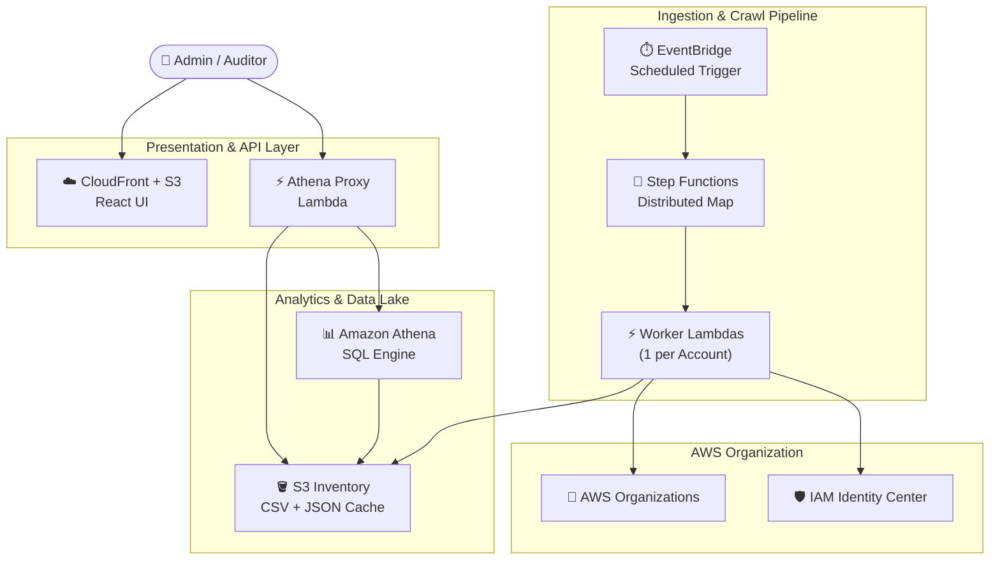

# AWS IAM Identity Center Governance Dashboard

> **A serverless, open-source dashboard to audit IAM Identity Center (SSO) permission assignments and permission set configurations across your entire AWS Organization — deployed in minutes with Terraform.**


[](https://opensource.org/licenses/MIT)
[](https://www.terraform.io/)
[](https://aws.amazon.com/)
[](CONTRIBUTING.md)

---

## Table of Contents

- [Overview](#overview)
- [Architecture](#architecture)
- [Features](#features)
- [Prerequisites](#prerequisites)
- [Quick Start](#quick-start)
- [Okta SSO Setup](#okta-sso-setup)
- [Configuration Reference](#configuration-reference)
- [Project Structure](#project-structure)
- [Security](#security)
- [Cost Estimate](#cost-estimate)
- [Contributing](#contributing)
- [License](#license)

---

## Overview

The **AWS IAM Identity Center Governance Dashboard** gives security teams and auditors a single-pane view of _who has access to what_ and _what each permission set contains_ across every account in an AWS Organization. It crawls IAM Identity Center assignments and permission set configurations on a configurable schedule (every 6 hours by default), stores structured snapshots in S3, and surfaces them through an interactive React UI — all without managing servers.

**Built for teams who need:**
- Continuous visibility into SSO permission sprawl and permission set configurations
- Audit-ready exports of assignments and permission set details across hundreds of accounts
- A zero-maintenance, cost-optimized setup (~$0.10–$5/month)

---

## Architecture



> **Data flow:** EventBridge triggers Step Functions on a schedule (every 6h by default) → Worker Lambdas crawl each AWS account's assignments in parallel, then crawl all permission set details → results are written to S3 → Athena queries the data → the React UI displays assignments and permission sets via the Athena Proxy Lambda.

---

## Features

| Feature | Description |
|---------|-------------|
| 🏢 **Full Org Crawl** | Discovers all accounts in your AWS Organization and audits IAM Identity Center assignments |
| 🔒 **Permission Set Details** | Crawls every permission set — AWS managed policies, customer managed policies, inline policies, permissions boundaries, session duration, tags |
| ⚡ **Distributed Processing** | Step Functions Distributed Map runs one Lambda per account in parallel |
| 👤 **User & Group Resolution** | Resolves GUIDs to friendly names, emails, and expanded group memberships |
| 🚀 **Fast-Load Cache** | Athena Proxy serves pre-rendered `summary.json` from S3 before falling back to SQL |
| 🔐 **SSO-Secured Frontend** | React dashboard protected by Okta OIDC — falls back to local auth for development |
| 💰 **Cost-Optimized** | No Glue Crawlers, auto-expiry lifecycle policies, fully serverless |
| 🛡️ **Security Hardened** | AES-256 encryption at rest, CloudFront OAC, input validation, IAM least-privilege |

---

## Prerequisites

Before you begin, ensure you have:

| Requirement | Version |
|-------------|---------|
| AWS Account | IAM Identity Center enabled |
| Terraform | `>= 1.5` |
| Node.js | `>= 18` |
| Python | `3.12` |
| AWS CLI | Configured with appropriate credentials |

### Required IAM Permissions

The IAM principal running `terraform apply` needs permissions for:

| Service | Actions |
|---------|---------|
| S3 | Create and manage buckets |
| Lambda | Create and manage functions |
| IAM | Create roles and policies |
| Step Functions | Create state machines |
| Athena & Glue | Create workgroups, databases, tables |
| CloudFront | Create distributions |
| CloudWatch Logs | Create log groups |

---

## Quick Start

### 1. Clone the Repository

```bash
git clone https://github.com/alfredkzr/aws-iam-identity-center-governance-dashboard.git
cd aws-iam-identity-center-governance-dashboard
```

### 2. Configure Variables

```bash
cp terraform.tfvars.example terraform/terraform.tfvars
```

Open `terraform/terraform.tfvars` and set these required values:

| Variable | Description | Example |
|----------|-------------|---------|
| `resource_prefix` | Unique prefix for all resources (used in S3 names) | `myorg-idc-gov` |
| `sso_instance_arn` | ARN of your IAM Identity Center instance | `arn:aws:sso:::instance/ssoins-xxxxxxxx` |
| `identity_store_id` | Identity Store ID | `d-xxxxxxxxxx` |

> **Where to find these:** AWS Console → **IAM Identity Center** → **Settings**

### 3. Deploy Infrastructure

```bash
cd terraform
terraform init
terraform plan     # Review planned changes
terraform apply
```

Terraform will automatically:
1. Provision all AWS infrastructure (S3, Lambda, Athena, CloudFront, Step Functions)
2. Build the React frontend with correct environment variables injected
3. Upload the build to S3 and invalidate the CloudFront distribution

The `frontend_url` output will be your dashboard URL:

```
Outputs:
  frontend_url = "https://d1234abcde.cloudfront.net"
```

> ⏱️ The first CloudFront deployment takes ~5 minutes to propagate globally.

### 4. Run the Initial Crawl

Trigger the Step Functions state machine to populate the dashboard with your first snapshot:

```bash
aws stepfunctions start-execution \
  --region $(terraform output -raw aws_region) \
  --state-machine-arn $(terraform output -raw step_functions_arn)
```

The dashboard will populate within **1–3 minutes** once the crawl completes. Subsequent crawls run automatically on the configured EventBridge schedule (every 6 hours by default).

---

## Okta SSO Setup

### 1. Create an Okta Application

> [!IMPORTANT]
> **Authentication Fallback:** If Okta is not configured, the dashboard defaults to **Local Auth Mode** for demonstration purposes. This uses hardcoded credentials (`admin` / `admin123`) in `AuthContext.js`. While useful for a quick PoC, **always remove these fallback credentials or configure Okta before exposing the dashboard to the public internet.**

1. Log into your [Okta Admin Console](https://your-org-admin.okta.com/admin/apps/active)
2. Go to **Applications → Create App Integration**
3. Select **OIDC – OpenID Connect** → **Single-Page Application (SPA)**
4. Click **Next**

### 2. Configure Redirect URIs

| Setting | Value |
|---------|-------|
| **App name** | `IAM Governance Dashboard` |
| **Grant type** | Authorization Code |
| **Sign-in redirect URI** (dev) | `http://localhost:3000/callback` |
| **Sign-in redirect URI** (prod) | `https://your-cloudfront-domain.cloudfront.net/callback` |
| **Sign-out redirect URI** (dev) | `http://localhost:3000` |
| **Sign-out redirect URI** (prod) | `https://your-cloudfront-domain.cloudfront.net` |

Click **Save**, then copy the **Client ID** from the General tab.

### 3. Set Environment Variables

**For local development**, create `frontend/.env`:

```bash
REACT_APP_OKTA_DOMAIN=your-org.okta.com
REACT_APP_OKTA_CLIENT_ID=0oaXXXXXXXXXXXXXXXXX
REACT_APP_OKTA_REDIRECT_URI=http://localhost:3000/callback
```

**For production**, set values in `terraform/terraform.tfvars` — Terraform injects them at build time:

```hcl
okta_domain    = "your-org.okta.com"
okta_client_id = "0oaXXXXXXXXXXXXXXXXX"
```

> The redirect URI is **auto-derived** from the current CloudFront origin — no manual configuration needed.

After deploying, remember to add the production callback URL to your Okta app's **Sign-in redirect URIs**.

---

## Configuration Reference

### Required Variables

| Variable | Type | Description |
|----------|------|-------------|
| `resource_prefix` | `string` | Prefix for all resource names (must be globally unique for S3) |
| `sso_instance_arn` | `string` | ARN of your IAM Identity Center instance |
| `identity_store_id` | `string` | Identity Store ID |

### Security Variables

| Variable | Type | Default | Description |
|----------|------|---------|-------------|
| `force_destroy_buckets` | `bool` | `false` | Allow `terraform destroy` to delete non-empty buckets |

### Cost & Performance Variables

| Variable | Type | Default | Description |
|----------|------|---------|-------------|
| `log_retention_days` | `number` | `7` | CloudWatch Logs retention period |
| `worker_reserved_concurrency` | `number` | `10` | Max concurrent worker Lambda executions |
| `athena_proxy_reserved_concurrency` | `number` | `5` | Max concurrent proxy Lambda executions |

### Optional Variables

| Variable | Type | Default | Description |
|----------|------|---------|-------------|
| `aws_region` | `string` | `us-east-1` | AWS deployment region |
| `project_name` | `string` | `idc-governance` | Tag applied to all resources |
| `environment` | `string` | `production` | Environment tag |
| `okta_domain` | `string` | `""` | Okta domain (e.g. `your-org.okta.com`) |
| `okta_client_id` | `string` | `""` | Okta OIDC client ID |

---

## Project Structure

```
aws-iam-identity-center-governance-dashboard/
├── terraform/                     # Infrastructure as Code
│   ├── main.tf                    # Provider & backend configuration
│   ├── variables.tf               # All configurable input variables
│   ├── outputs.tf                 # Terraform outputs (URLs, ARNs)
│   ├── s3.tf                      # S3 buckets (encrypted, lifecycle policies)
│   ├── frontend_hosting.tf        # S3 + CloudFront (auto-builds & deploys frontend)
│   ├── lambda.tf                  # Lambda functions (worker + athena proxy)
│   ├── iam.tf                     # IAM roles & policies (least privilege)
│   ├── athena.tf                  # Athena workgroup & Glue catalog (assignments + permission_sets tables)
│   ├── stepfunctions.tf           # Step Functions state machine (assignments crawl + permission sets crawl)
│   └── eventbridge.tf             # EventBridge scheduled trigger rule
├── backend/
│   ├── worker/                    # Assignment + permission set crawler Lambda (Python)
│   └── athena_proxy/              # Query lifecycle + cache Lambda (Python)
├── frontend/                      # React dashboard with Assignments & Permission Sets tabs
└── terraform.tfvars.example       # Configuration template — copy and fill in
```

---

## Security

The default deployment is already hardened out of the box — S3 buckets are encrypted (AES-256) with public access blocked, IAM policies follow least privilege, the Lambda API requires `AWS_IAM` auth via CloudFront OAC, and all data has auto-expiry lifecycle rules.

The items below are **post-deployment hardening steps** to consider when moving beyond a PoC:

### Recommended Hardening

| Action | Why | How |
|--------|-----|-----|
| **Attach AWS WAFv2** | Protect CloudFront against DDoS, bots, and OWASP Top 10 exploits | Create a `aws_wafv2_web_acl` with AWS Managed Rules and associate it with the CloudFront distribution |
| **Add a custom domain + TLS** | Replace the default `*.cloudfront.net` domain with your own branded, trusted domain | Create an ACM certificate in `us-east-1`, add a `viewer_certificate` block and Route 53 alias |
| **Enable geo-restriction** | Limit dashboard access to your operating regions only | Set `restrictions.geo_restriction` in the CloudFront distribution to `whitelist` your countries |
| **Disable local demo auth** | Remove hardcoded `admin/admin123` fallback credentials | Delete the `LOCAL_USERS` array and `loginLocal` function in `frontend/src/auth/AuthContext.js` |
| **Add CloudFront security headers** | Enforce HSTS, prevent clickjacking, disable MIME-type sniffing | Create a `aws_cloudfront_response_headers_policy` with security headers and attach to the distribution |
| **Protect sensitive variables** | Avoid committing org-specific IDs or ARNs | Keep all secrets in `terraform.tfvars` (git-ignored) or use a secrets manager |

---

## Cost Estimate

Fully serverless — **you only pay when things run.** The crawler runs every 6 hours by default (4×/day).

| Scale | Accounts | Estimated Monthly Cost |
|-------|----------|----------------------|
| **Small** | 20 | **~$0.10** |
| **Medium** | 100 | **~$0.50** |
| **Large** | 500 | **~$2.75** |

> Most small-to-medium deployments fall within the **AWS Free Tier**.

**💡 Reduce costs further:** Set `crawler_schedule_interval = "1 day"` in `terraform.tfvars` to crawl once daily instead of 4×. This cuts the largest cost driver (Step Functions) by ~75% — a 500-account org drops to **~$0.70/month**.

---

## Contributing

Contributions are welcome and appreciated! Here's how to get started:

### Submitting Changes

1. Fork the repository
2. Create a feature branch: `git checkout -b feature/your-feature`
3. Commit your changes: `git commit -m 'Add your feature'`
4. Push: `git push origin feature/your-feature`
5. Open a Pull Request

### Local Development Setup

**Frontend (React):**

```bash
cd frontend
npm install
npm start          # Runs dev server at http://localhost:3000
```

> Without Okta env vars configured, local auth is used. Default credentials: `admin` / `admin123`

**Backend (Python Lambdas):**

```bash
cd backend/worker
python3 -c "import handler"        # Verify imports resolve correctly

cd ../athena_proxy
python3 -c "import handler"        # Verify imports resolve correctly
```

**Infrastructure:**

```bash
cd terraform
terraform fmt      # Format HCL files
terraform validate # Validate configuration
terraform plan     # Preview changes before applying
```

### Reporting Issues

Please [open an issue](https://github.com/alfredkzr/aws-iam-identity-center-governance-dashboard/issues) with:
- A clear description of the problem
- Steps to reproduce
- Expected vs actual behavior
- Relevant logs or Terraform output

---

## License

[MIT](LICENSE) — free to use, modify, and distribute.
